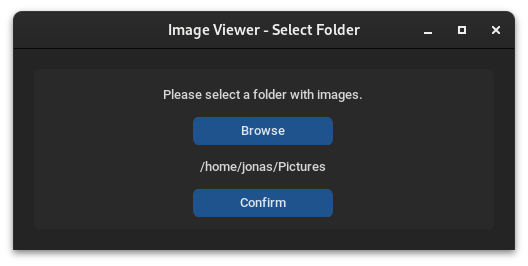
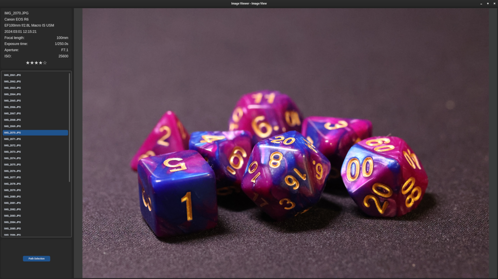

# CR3 Rating tool

## Description

This is a tool to rate CR3 files (Canon RAW 3) and write these ratings directly to the exif data of the CR3 and JPG file.

It needs [exiftool](https://exiftool.org/) to be installed on the system. You also have to shoot in RAW+JPG mode, because the JPG file is used to display the image. The rating is written to the CR3 and JPG file.

## Installation

1. Install exiftool from [https://exiftool.org/](https://exiftool.org/)
2. Install the required packages with `pip install -r requirements.txt`
3. Run the tool with `python main.py`

## Usage

1. Run the tool
2. Select the folder containing the CR3 files
3. Cycle through the images with the arrow keys
4. Rate the image with the number keys (`0-5`)
5. Zoom in/out with the `mouse wheel`
6. Reset zoom with `double click`
7. Press `Esc` to quit the tool

## Images

Path Selector:

Image Display:

## Dependencies
- [exiftool](https://exiftool.org/)
- [Pillow](https://pillow.readthedocs.io/en/stable/)
- [Customtkinter](https://customtkinter.tomschimansky.com/)

## License

This project is licensed under the MIT License - see the [LICENSE](LICENSE) file for details.